# NXP Application Code Hub

## AN14619: One-shunt FOC on MCX A
This application note describes the implementation of sensorless one shunt FOC on NXP MCX A series MCUs. Please refer to AN14619 <!--[AN14619](https://www.nxp.com/docs/en/application-note/AN14619.pdf)Will add after release --> for complete instructions on how to use this software.  
This application note mainly introduces the principle of one shunt PMSM FOC, hardware and software implementation with NXP development kit, including a detailed peripheral setup,driver description and FreeMASTER operation guide.

#### Boards: FRDM-MCXA153
#### Categories: Motor Control
#### Peripherals: ADC, PWM
#### Toolchains: MCUXpresso IDE

## Table of Contents
1. [Software](#step1)
2. [Hardware](#step2)
3. [Setup](#step3)
4. [Results](#step4)
5. [FAQs](#step5) 
6. [Support](#step6)
7. [Release Notes](#step7)

## 1. Software
- Download and install [MCUXpresso IDE V24.12.148 or later](https://www.nxp.com/design/design-center/software/development-software/mcuxpresso-software-and-tools-/mcuxpresso-integrated-development-environment-ide:MCUXpresso-IDE).
- Download and install the latest version of [FreeMASTER](https://www.nxp.com/design/software/development-software/freemaster-run-time-debugging-tool:FREEMASTER)(3.2.2.2).
- Download the code from Git repository an-mc-pmsm-one-shunt-mcxa153 <!--[an-pmsm-foc-mcxa153](https://github.com/nxp-appcodehub/an-pmsm-foc-mcxa153/browse)-->.  
- MCUXpresso for Visual Studio Code: This example supports MCUXpresso for Visual Studio Code, for more information about how to use Visual Studio Code please refer [here](https://www.nxp.com/design/training/getting-started-with-mcuxpresso-for-visual-studio-code:TIP-GETTING-STARTED-WITH-MCUXPRESSO-FOR-VS-CODE).

## 2. Hardware
- [FRDM-MCXA153 Development Board](https://www.nxp.com/design/design-center/development-boards-and-designs/FRDM-MCXA153).
- [FRDM-MC-LVPMSM](https://www.nxp.com/design/development-boards/freedom-development-boards/mcu-boards/nxp-freedom-development-platform-for-low-voltage-3-phase-pmsm-motor-control:FRDM-MC-LVPMSM).
- [LINIX 45ZWN24 motor](https://www.nxp.com/design/development-boards/freedom-development-boards/mcu-boards/low-voltage-3-phase-motor-for-frdm-platform:FRDM-MC-LVMTR).
- Personal Computer
- USB type-C cable and 24V adaptor.

## 3. Setup
### 3.1 Import project
#### 3.1.A Import project from Application Code Hub
1. Open MCUXpresso IDE, in the Quick Start Panel, choose **Import from Application Code Hub** 

     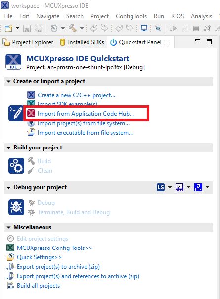

2. Found demo you need by searching the name directly or selecting tags you interested in. Open the project, click the **GitHub link** to then **Next**. 

    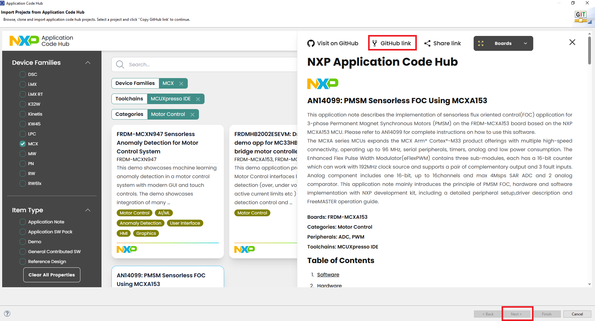 

3. Select **main** branch and then click **Next**.

    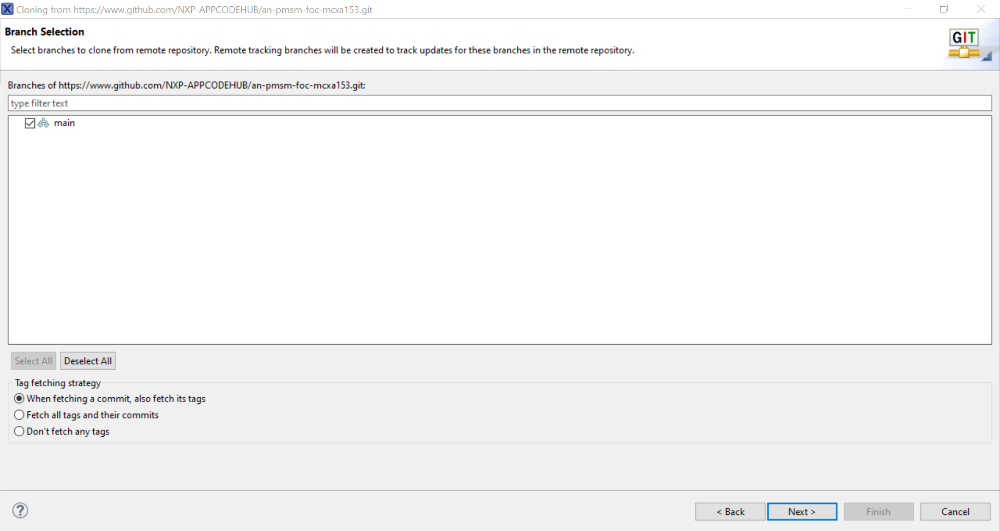

4. Select your local path for the repo in **Destination->Directory:** window. The MCUXpresso IDE will clone the repo to the path that your selected, **Next** after the clone process.

    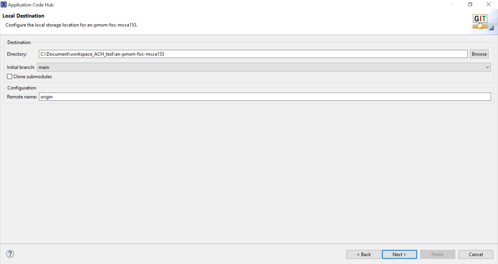  

5. Select **Import existing Eclipse projects** in **Wizard for project import** window then **Next**. 

    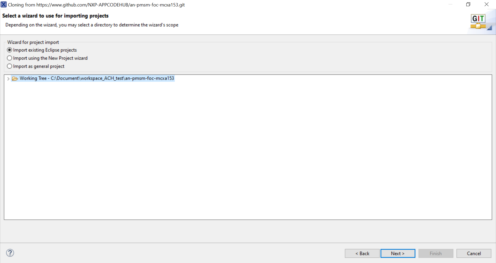 

6. Select the project in this repo(only one project in this repo) then **Finish**. 

    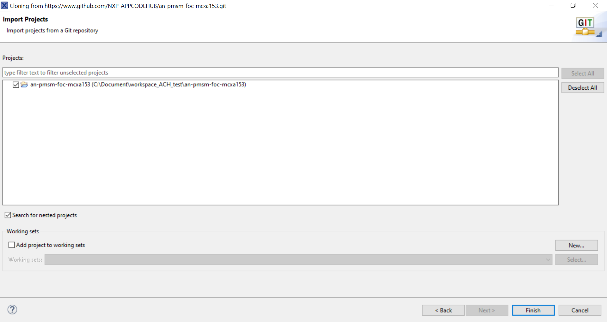
    
#### 3.1.B Import project after clone git repo to your local path
1. Clone repo **an-mc-pmsm-one-shunt-mcxa153** <!--[an-pmsm-foc-mcxa153](https://github.com/nxp-appcodehub/an-pmsm-foc-mcxa153/browse)-->from **GitHub**. Open MCUXpresso IDE, in the Quick Start Panel, choose **Import project(s) from file system** .

     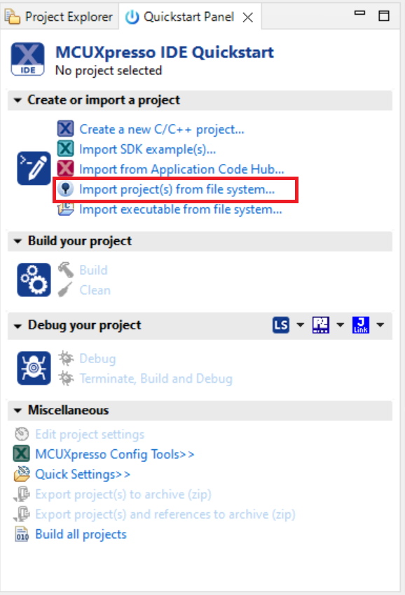

2. Select your local path of the repo in **Project directory(unpacked)** item then **Next**. If you download a compressed pack from GitHub, Select your local path of the package in **Project archive(zip)** item.

    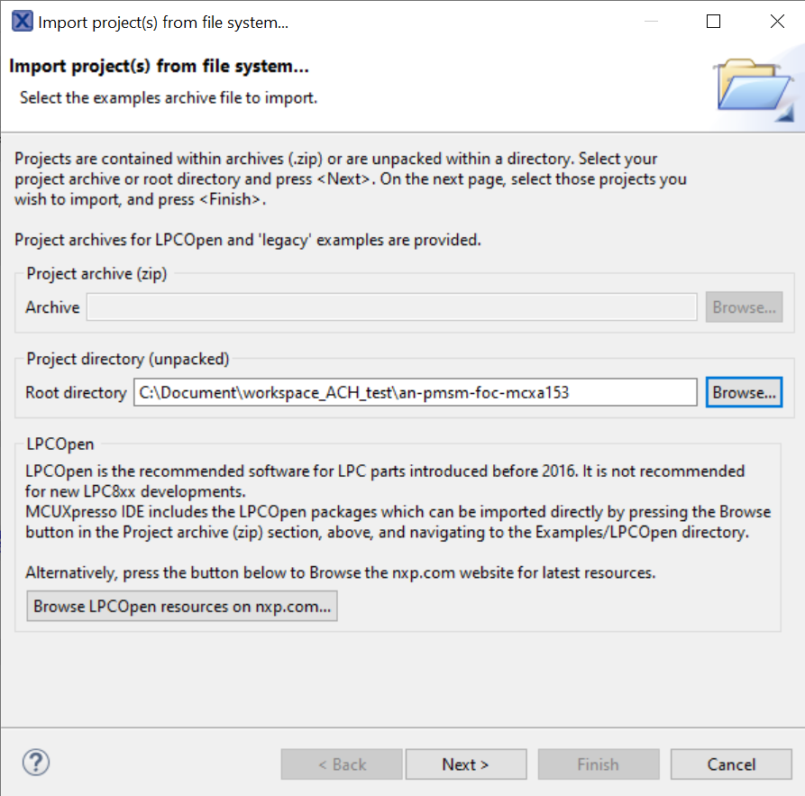 

3. Select the project in this repo(show in **Projects:** window, only one project in this repo), then **Finish**. . The project will be pasted to your IDE workspace if you click **Copy projects into workspace** in **Options** item, the change you made will be saved in the copy in workspace.

    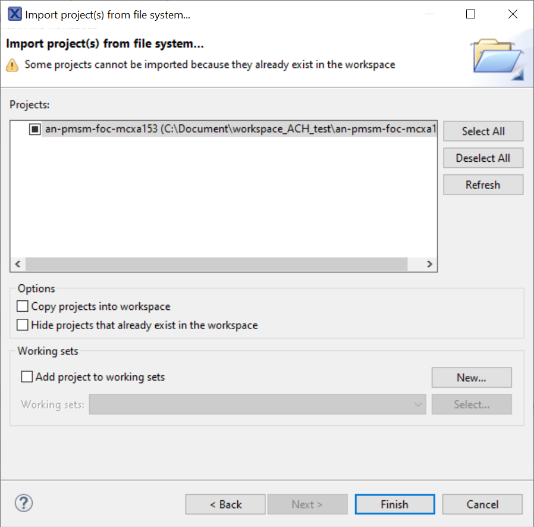

#### 3.1.2 Then you will see the project in **Project Explorer** window.
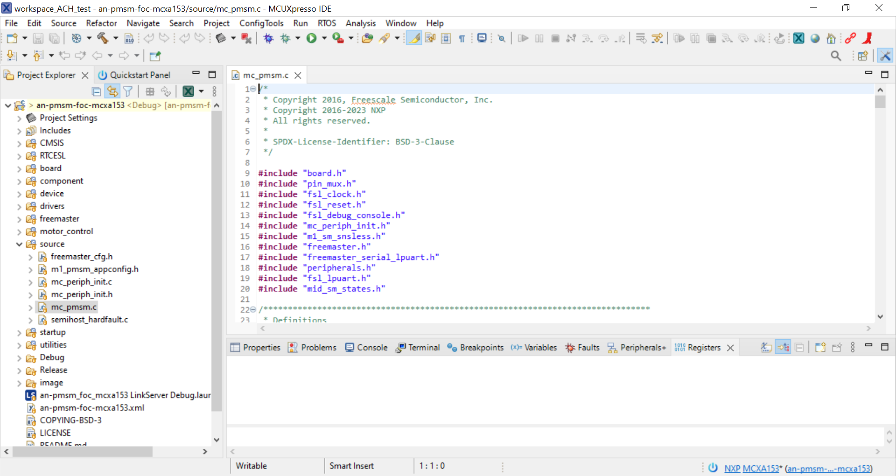

### 3.2 Compiler the project

This project contains two configurations, **Debug** and **Debug_SRAMX**. **Debug_SRAMX** configuration has a standalone link script to allocate frequently called code in SRAMX to improve performance. **Reight click** the project name in **Project Explorer** window, and select **Properties** to open properties window. Open **Manage Configurations**, select configuration you want to use then **Set Active**.
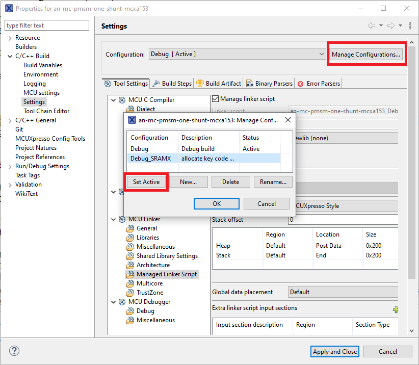

Use build botton in toolbar to compiler the project.  
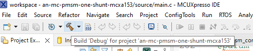
<!--
Memory region         Used Size  Region Size  %age Used
   PROGRAM_FLASH:       40148 B       128 KB     30.63%
            SRAM:        4144 B        24 KB     16.86%
          SRAMX0:          0 GB         8 KB      0.00%

Memory region         Used Size  Region Size  %age Used
   PROGRAM_FLASH:       40272 B       128 KB     30.73%
            SRAM:        4144 B        24 KB     16.86%
          SRAMX0:        8000 B         8 KB     97.66%   
-->
### 3.3 Hardware setup
Connect the **FRDM-MC-LVPMSM** shield to the **J1~J4** arduino connector of **FRDM-MCXA153** board. Connect the 3-phase wire of the motor to the J7 connector on FRDM-MC-LVPMSM according to phase sequence(**White** wide--phase**A**; **Bule** wide--phase**B**; **Green** wide--phase**C**). Power the FRDM-MC-LVPMSM board with a 24V adaptor.  
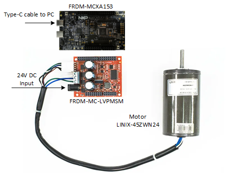  

Use a USB cable to connect to the FRDM board via **J15** connector. Download the code using debug button in tool bar after compiler. Select **CMSIS-DAP** or **J-Link** in **Debug As** according firmware in your on-board debugger. 
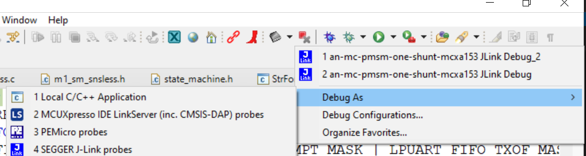  

### 3.4 Run the demo
Press SW2 on FRDM board to control the motor to run or stop. Or use FreeMASTER project **"pmsm_frac.pmpx"** in the code package to control the motor, change rotor speed and obverse the speed or other value.  **"pmsm_frac_SRAMX.pmpx"** is used for the **Debug_SRAMX** configuration.

Debug - Configuration  
Fast loop interval: 125us(8kHz);  
Fast loop processing time: 29.4us; <!--2824 -->  
Fast loop loading: 23.5%;  
Slow loop interval: 1ms(1kHz);  
Slow loop processing time: 4.0us;<!--383 -->  
Slow loop loading: 0.4%;  

Release - Configuration  
Fast loop interval: 125us(8kHz);  
Fast loop processing time: 21.28us; <!--2043 -->  
Fast loop loading: 17.0%;  
Slow loop interval: 1ms(1kHz);  
Slow loop processing time: 2.6us;<!--254 -->  
Slow loop loading: 0.3%;  

## 4. FreeMASTER operation
The FreeMASTER can be used to completely control and easily tune the sensorless FOC application. The operation of FreeMASTER setup is introduced here. 

Open **an-mc-pmsm-one-shunt-mcxa153\motor_control\freemaster\pmsm_frac.pmpx** in project path.  
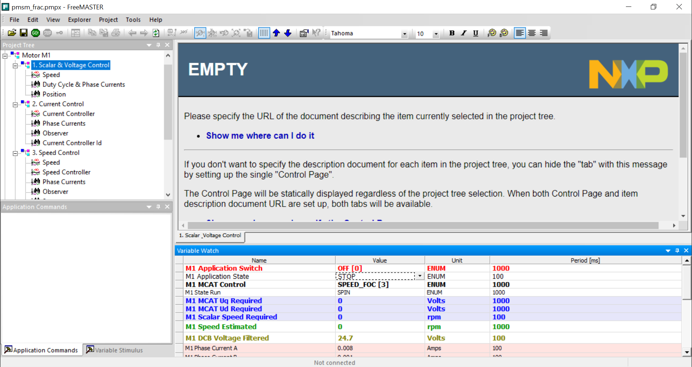

Open **Project->Options..** in FreeMASTER menu and go to **Comm** tag to configure COM number and communication speed.  
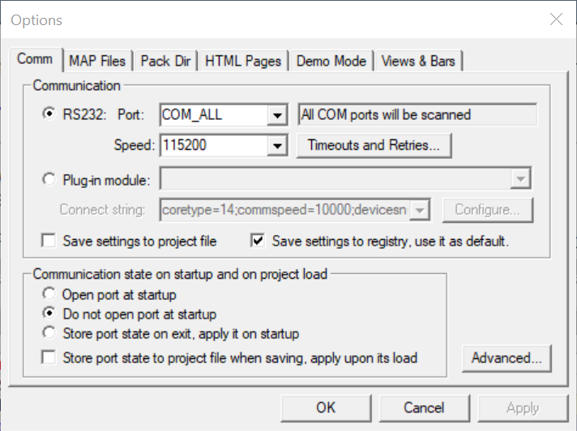

Then go to **MAP Files** tag. Select IDE generated map file **an-mc-pmsm-one-shunt-mcxa153\Debug\an-mc-pmsm-one-shunt-mcxa153.axf** or **an-mc-pmsm-one-shunt-mcxa153\Release\an-mc-pmsm-one-shunt-mcxa153.axf** in project path, generated after compiler the project. Choose **Binary ELF with DWARF2/DWARF4 dbg format.** tag in **File format:** window.  
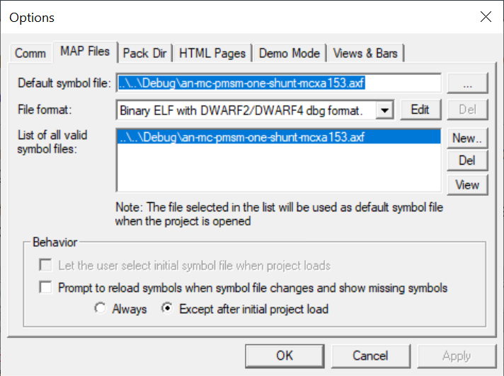

Click **Start Communication** in menu to connect to MCU board when MCU is running.  
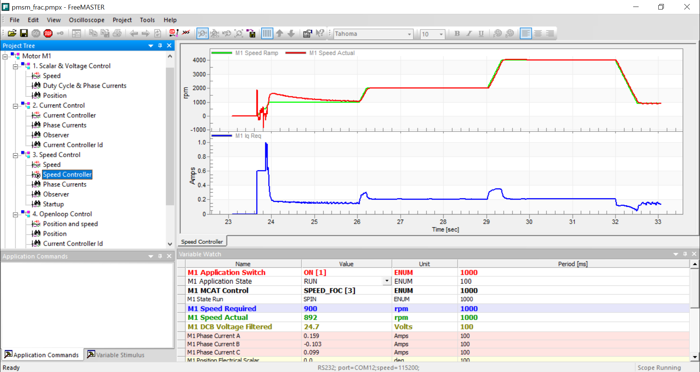

## 5. FAQs
*Include FAQs here if appropriate. If there are none, then remove this section.*

## 6. Support
*Provide URLs for help here.*

#### Project Metadata

<!----- Boards ----->

<!----- Categories ----->

<!----- Peripherals ----->

<!----- Toolchains ----->

Questions regarding the content/correctness of this example can be entered as Issues within this GitHub repository.

>**Warning**: For more general technical questions regarding NXP Microcontrollers and the difference in expected functionality, enter your questions on the [NXP Community Forum](https://community.nxp.com/)

## 7. Release Notes
| Version | Description / Update                           | Date                        |
|:-------:|------------------------------------------------|----------------------------:|
| 1.0     | Initial release on Application Code Hub        | July 11th 2025 |